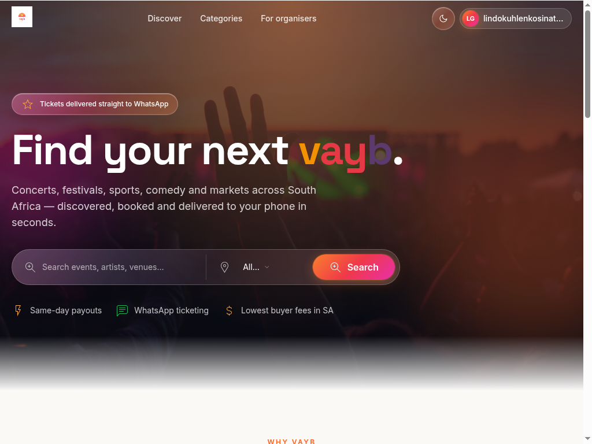
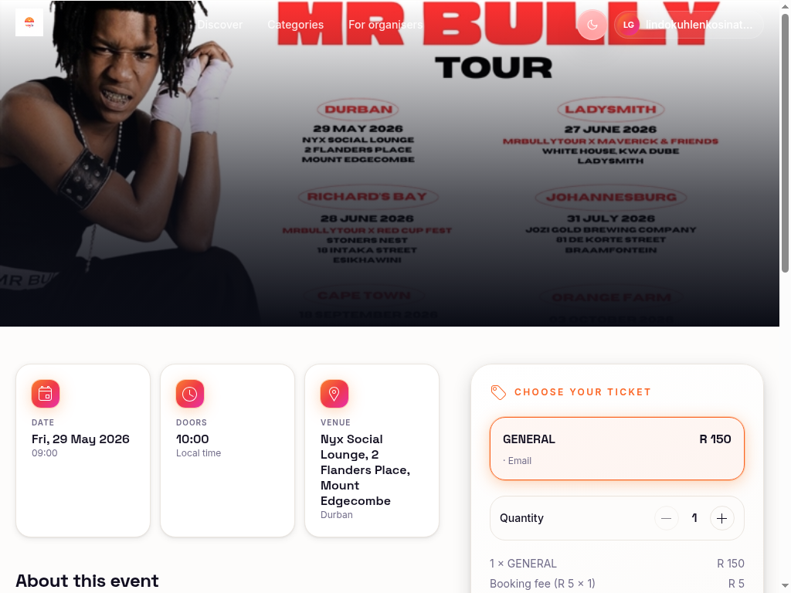
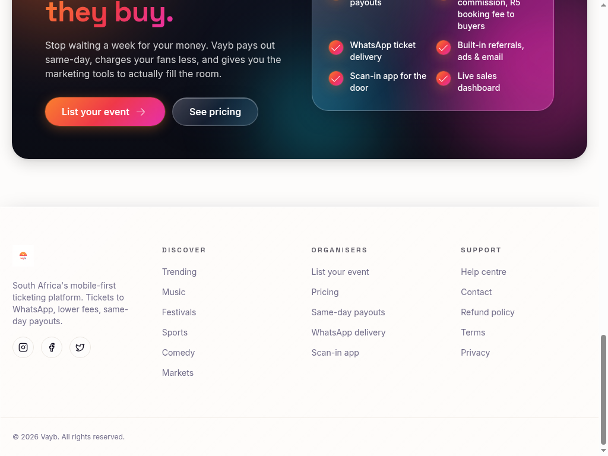

# Vayb

> South Africa's mobile-first ticketing platform — discover concerts, festivals, sports, comedy and markets, with tickets delivered straight to WhatsApp, low buyer fees, and same-day payouts for organisers.



---

## ✨ What is Vayb?

Vayb is a modern ticketing experience built for South Africa. Fans get a beautiful, fast way to find their next night out. Organisers get a low-fee, same-day-payout platform with WhatsApp delivery and a live sales dashboard.

- 🎫 **Tickets to WhatsApp** — no inbox digging, no lost PDFs
- ⚡ **Same-day payouts** — stop waiting a week for your money
- 💸 **Lowest buyer fees in SA** — 4% commission, R5 booking fee
- 📱 **Mobile-first** — designed for the way South Africans actually buy
- 🪩 **Liquid glass UI** — premium, glassy aesthetic with a sunset palette

---

## 📸 Screenshots

### Discover events
A bold hero with WhatsApp-first messaging, plus search by city across all 9 provinces.


### Event detail & ticket selector
Rich event pages with date, doors, venue, ticket tiers and live order summary.



### For organisers
Dedicated CTA section for promoters, with same-day payout and built-in marketing tools.



---

## 🧱 Tech Stack

- **React 18** + **Vite 5** + **TypeScript 5**
- **Tailwind CSS v3** with a fully tokenised design system (HSL semantic tokens, gradient + glass effects)
- **shadcn/ui** components
- **React Router** for routing
- **Lovable Cloud** (managed Supabase) for auth, database, storage and edge functions
- **PayFast** for South African card / EFT / Instant EFT payments
- **TanStack Query** for data fetching

---

## 🗺️ Pages

| Route | Description |
|---|---|
| `/` | Discover — hero, featured events, categories, organiser CTA |
| `/events/:id` | Event detail with ticket tiers and order summary |
| `/checkout/:id` | PayFast-powered checkout |
| `/auth` | Sign in / sign up (email + Google + Apple) |
| `/tickets` | Buyer's purchased tickets with QR codes |
| `/admin` | Organiser & admin dashboard |

---

## 🚀 Getting started

```bash
# install
npm install

# dev server
npm run dev

# typecheck + build
npm run build
```

The app is wired to Lovable Cloud automatically — no `.env` setup required when running inside Lovable. Locally, the `.env` is provisioned for you with `VITE_SUPABASE_URL` and `VITE_SUPABASE_PUBLISHABLE_KEY`.

---

## 💳 Payments

Checkout uses **PayFast** (live merchant) via the `create-payfast-payment` edge function, with the `payfast-itn` function handling secure server-side payment confirmation and ticket issuance.

---

## 🇿🇦 Built for South Africa

Vayb supports every major South African city across all 9 provinces — from Joburg and Cape Town to Mthatha, Polokwane, Mbombela and beyond.

---

© 2026 Vayb. All rights reserved.
